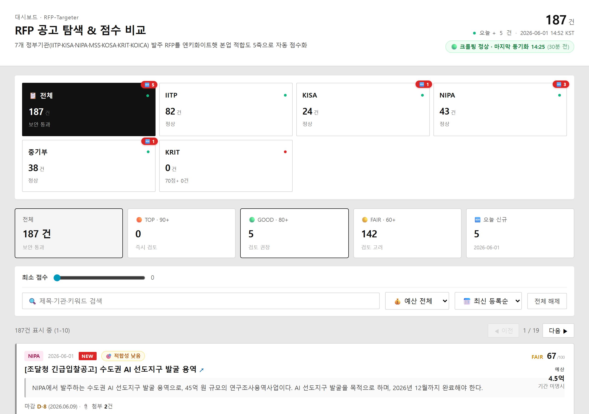

# RFP-Targeter

**엔키화이트햇** 공공 R&D 공고 자동 탐색 시스템 — IITP·KISA·KOSA·KRIT·NIPA·MSS·KOICA 7개 기관 매시간 폴링 → 보안 키워드 매칭 → 5축 점수 → 정적 사이트 + 슬랙 알림.

🌐 **Live**: [https://yellowcornsalad.github.io/RFP-Targeter/](https://yellowcornsalad.github.io/RFP-Targeter/) (v1.0)



---

## 인프라 (24/7, PC OFF 무관)

| 컴포넌트 | 위치 | 주기 |
|---|---|---|
| 크롤링 | GitHub Actions | 매시 정각 |
| DB | Supabase PostgreSQL | 클라우드 상주 |
| 대시보드 | GitHub Pages (정적 빌드) | 매시 자동 갱신 |
| 슬랙 알림 | Incoming Webhook | 평일 09~21 KST |
| 회귀 경보 | Slack | 첨부율 임계값 미만 시 |

---

## 빠른 시작

```powershell
# 0. 의존성
pip install -e .

# 1. 회사 프로필 추출 (enkiwhitehat.com → config/profile.yaml)
python scripts/init_profile.py
# → config/profile.yaml 열어서 ??? 표시된 항목 채우기

# 2. 크롤 1회 실행 (Mock 데이터로 파이프라인 검증)
python scripts/run_once.py

# 3. 대시보드
streamlit run src/rfp_targeter/dashboard.py

# 4. 백그라운드 폴링 (별도 터미널)
python -m rfp_targeter.scheduler
```

---

## 디렉터리 구조

```
RFP-Targeter/
├── .streamlit/
│   └── config.toml            # Cobalt Blue 네이티브 테마
├── config/
│   ├── settings.yaml          # 폴링 주기, 점수 가중치, 소스 enable
│   ├── keywords.yaml          # 보안 1차 필터 키워드
│   ├── secrets.example.yaml   # API 키 템플릿
│   ├── secrets.yaml           # (gitignore) 실제 키
│   ├── profile.example.yaml   # 회사 프로필 템플릿
│   └── profile.yaml           # (gitignore) 실제 프로필
├── data/
│   ├── rfp.db                 # SQLite (gitignore)
│   └── attachments/           # 첨부 파일 다운로드 (gitignore)
├── templates/                 # 기관별 RFP 양식 (gitignore, 자동 채워짐)
├── drafts/                    # 자동 생성된 초안 (gitignore)
├── assets/
│   ├── enki_logo.png          # 사이드바 로고
│   └── theme_previews/        # 후보 테마 6종 HTML mockup
├── src/rfp_targeter/
│   ├── config.py
│   ├── pipeline.py            # 크롤 → 필터 → 점수 → 저장 오케스트레이션
│   ├── scheduler.py           # 1시간 폴링 (APScheduler)
│   ├── dashboard.py           # Streamlit UI (Cobalt 테마 + production UX)
│   ├── crawlers/              # 사이트별 어댑터 (9종)
│   ├── filters/               # 보안 키워드 필터
│   ├── scoring/               # 5축 점수 + 테마 적합도
│   ├── attachments/           # 첨부 다운로더 + 텍스트 추출 + 자동 분류
│   ├── profile/               # 회사 프로필 추출기
│   ├── drafter/               # RFP 초안 생성기 (수동 + Claude API)
│   └── db/                    # SQLite 스키마 + 모델
└── scripts/
    ├── run_once.py            # 1회 크롤
    ├── verify_crawlers.py     # 어댑터 검증 (소스별 3건 샘플)
    ├── init_profile.py        # 회사 프로필 초기 추출
    ├── generate_drafts.py     # 초안 일괄 생성
    └── iitp_retry.py          # IITP 단독 재시도
```

---

## 점수 산정 (5축, 각 0~100)

총점 = 5축 가중합(0.35·0.10·0.20·0.20·0.15) + **theme_fit 보너스** (최대 ±20)

| 축 | 의미 | 가중치 | 데이터 신뢰도 |
|----|------|-------|--------------|
| **keyword** | 회사 핵심 키워드 매칭도 | **0.35** | ⭐⭐⭐ 본문 직접 매칭 |
| **budget** | 회사 적정 예산 범위 적합 | **0.10** | ⭐⭐ 본문 명시 시 / 없으면 35 폴백 |
| **consortium** | 컨소시엄 구성 부담(낮을수록 ↑) | **0.20** | ⭐⭐ 본문 키워드 휴리스틱 |
| **competitor** | 경쟁 상황(적을수록 ↑) | **0.20** | ⭐ **휴리스틱 추정만** ([한계 참조](#-경쟁-점수의-한계)) |
| **trl** | 회사 보유 기술 TRL 적합 | **0.15** | ⭐⭐⭐ 본문 TRL 패턴 추출 |

별도 지표: **theme_fit** (회사 테마 적합도, 0~100) — 총점에 보너스로 가산.

가중치는 `config/settings.yaml` 의 `scoring_weights` 에서 조정.

---

### 🔎 각 축 산정 공식 상세

#### 1. keyword (가중치 0.35) — `scoring/keyword.py`

회사 `profile.yaml` 의 키워드가 공고 제목·요약·본문에 등장하는지.

**[2026-05-27 v2 재설계]** 이전 공식은 정부 공고에 거의 안 나오는 회사 자체 키워드(`OFFen`/`ASM`)는 매칭 0건이면서, 일반 보안 사전 매칭(`보안`/`AI` 등)만으로 boost ×8 ⇒ 활성 보안 31%가 100점 만점이 되어 변별력 상실. 그래서 회사 자체 신호 가중치를 ↑, 일반 사전 매칭은 log scale 로 포화시켜 인플레이션 차단.

```
baseline = 30                          (보안 필터 통과 = 회사 영역 진입)

+ core_keywords 매칭 1개당     ×25     (cap 50, 회사 자체 제품/기술 — 강한 신호)
+ positioning 매칭 1개당       ×10     (cap 20, 포지셔닝 메시지 일치)
+ 일반 보안 사전 매칭          log2(N+1) × 7  (cap 35, 포화 곡선)

= 최종 (max 100)
```

**동의어 그룹화 (카운트 인플레이션 차단)** — keywords.yaml 표기 변형을 1 카운트로 통합:
- `보안 / 사이버보안 / 사이버 보안 / 정보보호 / 정보 보호` → 1개
- `AI / 인공지능 / 에이아이` → 1개
- `PQC / 양자내성암호 / 포스트퀀텀암호` → 1개
- ... 총 15 그룹

**현재 분포 (활성 보안 297건)**:
| 구간 | 건수 | 비율 |
|---|---|---|
| 95-100점 | 5건 | 1.7% (회사 직격만) |
| 70-94점 | 6건 | 2% |
| 55-69점 | 182건 | 61% (중심 분포) |
| 40-54점 | 110건 | 37% |

> profile.yaml 의 `core_keywords` 미설정 시 → 중립 50점 폴백.

#### 2. budget (가중치 0.10) — `scoring/budget.py`

공고에 명시된 예산이 회사 평가 정책에 맞는지.

**[2026-05-27 v2 정책 변경]** 이전: 100억+ → 25점 페널티(컨소시엄으로 가능한 거대 사업도 차단). 새 정책: **연간 1억 이상이면 회사가 긍정적, 너무 큰 예산도 컨소시엄으로 분담 가능 → 부정 평가 X**.

```
profile.yaml.budget_range = { sweet_spot_min, sweet_spot_max }  (5억~40억)

본문 예산 미명시 (NULL)               → 35점 (정보 부족 페널티, 유지)
< 1억 (100백만원 미만)                → 25~50점 선형 (작음, ROI 낮음)
1~5억 (100~499백만원)                 → 70~95점 선형 (1억+ 회사 긍정 영역)
5~40억 (500~4000백만원, SWEET SPOT) → 100점 (OFFen 단독 수행 적정)
40~100억 (4001~10000백만원)          → 90~100점 선형 (대형, 컨소시엄 검토)
100억+ (10000백만원 초과)             → 80~90점 (컨소시엄 필수, 부정 X)
```

**점수 곡선 시각화**:
```
점수
100 ┤      ┌──────────┐
 95 ┤     ╱            ╲___________
 80 ┤    ╱                          ──────  (100억+ floor 80)
 70 ┤  ╱
 50 ┤ ╱  ← NULL = 35점
 25 ┤╱
  0 └────┬───┬──┬───────┬─────┬──────────→ 예산
       0  1억 5억      40억  100억      300억
```

**예시 매칭**:
- 1.5억 (SW 평가보증 지원사업) → 82.5점
- 9.3억 (조선 AX 모델하우스) → 100점 (sweet spot)
- 90억 (AI 청년창업 바우처) → 100점 (sweet spot)
- 614,300백만원 (6,143억, 중기부 정책자금) → 80점 (컨소시엄 가능)

> 가중치 0.10으로 작게 — 본문에 예산 안 나오는 경우 다수라 신뢰도 낮춤.

#### 3. eligibility (자격 적합도, 가중치 0.20) — `scoring/eligibility.py`

**[2026-05-27 재설계: consortium → eligibility 교체]**

이전 consortium 점수는 회사 자산 풍부(5 파트너 + KAIST 공동특허 + solo_capable)으로 거의 모든 공고가 85~100점에 압축돼 변별력 거의 없었음. → 자격 요건 매칭으로 교체.

**점수 목적**: 공고가 요구하는 **자격 요건**을 회사가 만족하는지 판단. 응찰 가능 여부를 직접 점수화.

```
baseline = 60  (자격 요건 본문 명시 없으면 자유 응찰 가정)

─── POSITIVE (회사 매칭 → 가점) ───────────────────────
"중소기업 한정/우대"            → +20 (회사 size="중소")
"정보보호 전문기업"             → +20 (회사 KISA 2026 신기술 선정)
"보안 전문 인력 N명 이상"       → +15 (회사 화이트해커 보유)
"창업 N년 이내" (N ≥ 회사 연차) → +20 (회사 10년차, 2016 창업)

─── NEGATIVE (회사 부적합 → 감점) ─────────────────────
"박사후 연구원/대학원생" 한정  → −50 (기업 응찰 불가)
"대기업 한정"                   → −40 (회사 중소기업 비매칭)
"비영리법인/공공기관" 단독      → −40
"창업 N년 이내" (N < 회사 연차) → −30

─── NEUTRAL (자격 명시 없음) ──────────────────────────
baseline 60 유지 (대다수 공고 — 자격 자유)
```

**예시 시나리오**:
| 공고 | 자격 적합도 |
|---|---|
| "중소기업 우대 + 정보보호 전문기업" | 60 + 20 + 20 = **100점** ✅ |
| "보안 전문 인력 + 창업 5년 이내" (회사 10년차) | 60 + 15 − 30 = **45점** ⚠️ |
| "박사후 연구원 한정 R&D" | 60 − 50 = **10점** ❌ (응찰 불가) |
| 자격 명시 없음 | **60점** (baseline) |

**회사 자격 기준 (profile.yaml.company)**:
- size: "중소" — 중소기업 우대 공고 매칭
- established_year: 2016 (현재 10년차) — "창업 N년 이내" 자동 비교
- KISA 2026 신기술 선정 — "정보보호 전문기업" 매칭
- 화이트해커 23.8만 건 DB — "보안 전문 인력" 매칭

> ⚠️ **DB 컬럼명**: `consortium_score` (legacy 유지, 마이그레이션 회피). 의미만 eligibility 로 교체. UI 라벨도 "자격" 으로 변경.

##### 📚 보존된 consortium 로직 (참고용)

이전 consortium 점수는 `scoring/consortium.py` 에 그대로 보존됨. 향후 변별력 확장 시 (예: profile.yaml.consortium 정밀화 + 산학연 비율 신호 추가) 재활용 가능.

- KAIST·가천대·세종대 (대학 3곳), 쏘마·엔플러스랩 (기업 2곳) 자산은
  여전히 RFP 초안 생성기·theme_fit 점수에서 활용됨
- ecosystem_partners 8곳도 RFP 초안의 "협력 시너지" 섹션에서 자동 인용

#### 4. competitor (가중치 0.20) — `scoring/competitor.py`

**[2026-05-27 v2 재설계]** 이전 공식: 73%가 baseline 50점에 묶임 (키워드 풀 PQC·AI보안 등 7개만으로 협소). 새 공식: 회사 본업 키워드 18개 + 대기업 영역 10개 + 발주기관 가중치.

```
baseline = 50  (정보 없으면 중간값)

─── 회사 본업 영역 (저경쟁 추정 +가점, cap +35) ───
오펜시브:    모의해킹·침투테스트·취약점 진단·공격 시뮬레이션·Red Team·화이트해커
ENKI 제품:   ASM·CTEM·AI DAST·AI Hacker·공격표면
보안 자동화: 보안 자동화·보안성 검증·취약점 분석
암호 전문:   양자내성·PQC·동형암호·비밀계산
임베디드:   펌웨어 보안·임베디드 보안
위협 인텔:   사이버 위협 인텔리전스
                                              → 매칭당 +8, cap +35

─── 대기업/대형 SI 영역 (고경쟁 추정 −감점, cap −30) ───
관제 운영:   통합관제·통합보안관제·MSSP·SOC·SIEM·SOAR
플랫폼/SI:   통합 플랫폼·차세대 보안 플랫폼·IT 인프라·ICT 기반시설
인프라:     통신 보안·사내망 보안·데이터센터 보안·전산실 구축
                                              → 매칭당 −10, cap −30

─── 발주기관 가중치 ───
KISA / 한국인터넷진흥원              +10  (회사 KISA 2026 신기술 선정)
정보통신산업진흥원 (NIPA) / IITP     +5   (R&D 영역)
조달청                               −3   (일반 입찰 — 경쟁 보통)

─── 기타 ───
본문 200자 미만                       −5  (신뢰도 낮춤)
profile.competitors 회사명 본문 등장 −15
```

**현재 분포 (활성 보안 820건)**:
| 점수 | 건수 | 의미 |
|---|---|---|
| 60-76점 | 51건 (6%) | 회사 본업 + KISA 발주 매칭 |
| 50점 | 572건 (70%) | baseline (신호 없음) |
| 40-45점 | 193건 (24%) | 대기업 영역 신호 |
| 30-35점 | 4건 (0.5%) | 강한 대기업 영역 |

##### ⚠️ 경쟁 점수의 한계 (지속 적용)

**우리 시스템은 실제 응찰자 수를 모릅니다.** 정부 입찰은 익명 진행이고, 응찰 정보는 낙찰 후에만 공개됩니다. 그래서 이 점수는:

- **본문 키워드 기반 영역 난이도 추정치** — 실제 경쟁자 수와 다를 수 있음
- **baseline 50인 경우 = "추정 불가, 중간값"** — 본문에 매칭 키워드가 하나도 안 잡혔다는 뜻
- KISA 사전규격공개 의견 접수는 비공개 이메일 채널 → 외부 수치화 불가
- 향후 G2B 낙찰결과 API 또는 발주기관별 통계로 강화 검토 (별도 트랙)

→ 카드 검토 시 **keyword·budget·TRL 축을 더 신뢰**하고, competitor는 **참고 지표**로만 보세요.

#### 5. trl (가중치 0.15) — `scoring/trl.py`

공고에서 요구되는 기술 성숙도(TRL 1~9)와 회사 보유 TRL(8~9 사업화/상용화)의 갭.

**[2026-05-27 v2 재설계]** 이전 공식: 100점 일치 0건 (회사 TRL 모두 8-9인데 추정 패턴 단순). 새 공식: 키워드 패턴 정밀화 + 발주기관 default + gap 점수 조정.

```
─── 1. TRL 직접 명시 (가장 신뢰) ───
"TRL 5~7" / "TRL: 7" 패턴 매칭            → 명시값 사용

─── 2. 본문 키워드 추정 (높은 TRL 우선) ───
TRL 3: 기초연구·탐색연구·개념증명·원리 규명
TRL 4: PoC·시제품·프로토타입·랩 검증·실험실 검증
TRL 5: 원천기술·응용연구·기술개발
TRL 6: 파일럿·Pilot·베타 테스트·기능 시험
TRL 7: 실증·테스트베드·운영 환경 시험·필드 테스트
TRL 8: 사업화·시장 진입·제품화·양산 준비
TRL 9: 상용화·표준화·확산·보급·인증

─── 3. 발주기관 default (키워드 추정 실패 시 fallback) ───
KISA / 한국인터넷진흥원        → TRL 7  (실증·사업화)
정보통신산업진흥원 (NIPA)      → TRL 7  (실증·사업화)
정보통신기획평가원 (IITP)      → TRL 5  (응용연구)
중소벤처기업부 (MSS)           → TRL 8  (사업화)

─── 4. gap 별 점수 (회사 보유 TRL과 비교) ───
gap 0 (정확 일치)              → 95점   ← 만점급 (드문 직격)
gap 1 (인접 단계, KISA 다수)   → 85점
gap 2                          → 70점
gap 3                          → 55점
gap 4+ (큼)                    → 40점

추정 불가 + 발주기관 default도 없음 → 55점 (중간값)
회사 TRL 미설정                      → 55점 (폴백)
```

**현재 분포 (활성 보안 820건)**:
| 점수 | 건수 | 의미 |
|---|---|---|
| 95점 | 455건 (56%) | gap 0 (KISA TRL 7 + 회사 TRL 8 매칭) |
| 85점 | 69건 (8%) | gap 1 (인접) |
| 70점 | 3건 (0.4%) | gap 2 |
| 55점 | 272건 (33%) | 추정 불가 (default) |
| 40점 | 21건 (2.6%) | gap 4+ (회사 TRL 8-9와 먼 IITP 기초연구) |

> 회사 보유 TRL은 `profile.yaml.technologies[*].trl` 5개 항목 모두 8-9 (사업화/상용화 단계).

---

### 🎯 theme_fit (별도 지표) — `scoring/keyword.score_theme_fit`

회사 본업·테마 직격도 종합 평가. **5축 외 별도 점수**, 단 **총점에 보너스로 가산**.

```
baseline = 25

+ 회사 보유 기술 매칭 1개당     +15  (최대 +40)
+ core_keywords 매칭 1개당      +4   (최대 +20)
+ positioning_keywords 1개당    +6   (최대 +15)
+ 보안 필터 매칭 ≥ 6개          +25
+ 보안 필터 매칭 ≥ 3개          +15
+ 본문 1500자 이상              +3
+ 발주 부서 티어 가산:
    tier1_security             +25  (보안 직격 부서)
    tier2_core                 +15  (회사 본업 핵심 부서)
    tier3_adjacent             +8   (인접 영역)
= 최종 (max 100)
```

**총점 보너스** (`engine.py`):
```
theme_fit ≥ 90  → 총점 +20
theme_fit ≥ 80  → 총점 +12
theme_fit ≥ 60  → 총점 +6
theme_fit < 30  → 총점 −10
```

---

### 📐 총점 산정 흐름 (사진 예시 검증)

사진의 카드 (키워드 100 / 예산 64 / 컨소시엄 100 / 경쟁 50 / TRL 45 / 테마 68):

```
가중합   = 100×0.35 + 64×0.10 + 100×0.20 + 50×0.20 + 45×0.15
       = 35.00 + 6.40 + 20.00 + 10.00 + 6.75
       = 78.15

theme_fit 68 → +6 보너스

총점    = 78.15 + 6 = 84.15  → 약 84점
```

---

### 🎚 등급 기준 (UI 표시)

| 등급 | 점수 | 의미 | 슬랙 알림 |
|------|------|------|----------|
| 🟠 **TOP** | 90+ | 즉시 검토, 본업 직격 | ✅ + 1억+ 시 |
| 🟢 **GOOD** | 80~89 | 검토 권장, 적합도 높음 | ✅ + 1억+ 시 |
| 🟡 **FAIR** | 60~79 | 검토 고려 | ❌ |
| ⚪ **검토** | <60 | 우선순위 낮음 | ❌ |

슬랙 알림 규칙: **총점 ≥ 80 AND budget_mw ≥ 100(1억) AND 활성 공고** (영업시간 09~21 KST 발사, 외 시간은 누적 → 다음 영업일 09시 묶음).

---

## 🔑 시스템이 사용하는 모든 키워드 + 수치 산출 흐름

점수가 만들어지기까지 시스템이 거치는 **3단계 키워드 매칭 파이프라인** + 각 단계에서 사용되는 키워드 전체 목록.

### 파이프라인 한눈에

```
[크롤링 raw 공고]
       │
       ▼
┌────────────────────────────────────┐
│ ① 보안 1차 필터 (config/keywords.yaml) │   "이 공고가 우리 영역인가?" 결정
│   - must_any 매칭? → 통과            │   매칭 키워드 = a.matched_keywords
│   - exclude 키워드? → 탈락           │   (한 공고당 평균 5~15개)
│   - 부서 화이트리스트 매칭? → 통과    │
└────────────────────────────────────┘
       │
       ▼ is_security = TRUE
┌────────────────────────────────────┐
│ ② 5축 점수 산정 (scoring/*.py)        │   회사 profile.yaml 키워드 + 본문
│   - keyword: profile.yaml × 본문     │   대조해서 0~100 점수 계산
│   - budget/consortium/competitor/trl │
└────────────────────────────────────┘
       │
       ▼ score_total
┌────────────────────────────────────┐
│ ③ theme_fit (보너스) + 가중합 → 총점  │   ≥80 AND 1억+ → 슬랙 발사
└────────────────────────────────────┘
```

---

### 🛡 ① 보안 1차 필터 — `config/keywords.yaml` (총 250+개)

#### `must_any` — 하나라도 매칭되면 통과 (OR)

| 카테고리 | 키워드 예시 | 개수 |
|---------|-----------|------|
| **일반 보안** | 사이버보안, 정보보호, 침해대응, 위협 인텔리전스 | 9 |
| **기술 영역** | 암호, 양자내성암호, PQC, 동형암호, 제로트러스트, 취약점, 침투시험, 모의해킹, 화이트해커, APT, SOC, SIEM, SOAR, XDR, EDR, NDR, DLP, SBOM, 공급망 보안 | ~28 |
| **도메인** | 클라우드 보안, OT 보안, ICS 보안, IoT 보안, 차량 보안, AI 보안, 5G/6G 보안, 블록체인 보안 | ~15 |
| **영문** | cybersecurity, infosec, penetration test, vulnerability | 7 |
| **경계 영역 (AI/SW/DX)** | 인공지능, AI, 머신러닝, 딥러닝, LLM, 생성형 AI, 클라우드, SW, 디지털전환, DX, AX, SaaS, IoT, 양자컴퓨팅 | ~30 |
| **A. 정부 R&D 일반** | 사업공고, 모집공고, 지원사업, 신규과제, 공모, RFP, 제안요청서, 용역, 실증사업, 연구개발 | ~25 |
| **B. 산업 도메인** | 제조, 스마트제조, 바이오, 헬스케어, 의료, 환경, 에너지, 신재생, 물류, 콘텐츠, 농업, 우주, 항공, 해양, 조선, 자동차, 식품 | ~24 |
| **C. 디지털 인프라** | 플랫폼, 시스템, API, 인프라, 네트워크, 통신망, 데이터센터, 모바일앱, 비대면 | ~13 |
| **D. 신기술** | 로봇, 자율주행, 모빌리티, 드론, UAM, 위성, 반도체, 디스플레이, 배터리, 이차전지, 센서, VR/AR/XR, 3D프린팅 | ~19 |
| **E. 지원 형태** | 바우처, 컨설팅, 창업, 스타트업, 수출, 해외진출, 인재양성, 재직자 교육, 일자리, 매칭, 투자유치, 액셀러레이팅 | ~18 |
| **F. 정책·규제·인증** | 인증, 표준화, 규제샌드박스, 실증특례, 시험인증, 시험평가, 적합성평가, 시범도시, 리빙랩, 규제혁신 | ~16 |

**총 `must_any` ≈ 200개**. 키워드 매칭 시 정규화: `text.replace(" ", "").lower()` → "사이버 보안" = "사이버보안" 동일.

#### `boost` — 매칭 시 점수 가산 (회사 OFFen 특기 영역)

```yaml
OFFen, AI DAST, DAST, PTaaS, ASM, Attack Surface Management,
공격표면 관리, 화이트해커, 침투시험, 자율 침투, LLM 기반 침투,
Lateral Movement, Privilege Escalation, 레드팀, red team,
취약점 분석, 보안성 검증, 0-day, CVE 매핑, 공격 경로 분석,
보안 자동화, CTEM, 침투 차단율, AI 기반 보안, AI 자율,
제로트러스트, 사이버 자산 식별, 자산 신뢰도, 취약점 가치 평가,
취약점 체이닝, 크리덴셜 위협 인텔리전스, 펌웨어 변조 탐지,
페이로드 생성, 사이버 위협 탐지 규칙, 사이버 공방 훈련,
스마트 교통 보안, 차량 보안, 서비스 가용성 평가, 양자내성암호, PQC,
STIX, CVSS, CWSS, OVAL, QKD, 양자 키 분배, ISMS 효과성 측정
```

회사 **OFFen 라인업** (자체 제품) + **특허 38건** + **표준 28건** 활동 영역 + **KAIST 공동 R&D** 분야 직접 매핑. 약 50+개.

#### `exclude` — 있으면 탈락

```yaml
물리보안, 출입 통제, CCTV 시스템, 무인경비
```

#### `must_any_agency` — 부서 정확 매칭으로 자동 통과

키워드 매칭 약해도 발주 부서가 이 목록에 정확히 일치하면 통과 (data.go.kr 통합 공고에서 누락 방지).

| 분류 | 부서명 |
|------|-------|
| **보안 직격** | 정보보호기획과, 정보보호산업과, 정보보호제도과, 정보보호정책과, 사이버안전과, 사이버침해대응과 |
| **ICT R&D** | 정보통신방송기술정책과, 정보통신기술기획과, 정보통신기획과 |
| **AI·데이터** | 인공지능데이터정책과, 인공지능데이터진흥과, 인공지능기반정책과, 디지털플랫폼정부데이터정책과 |
| **네트워크** | 네트워크정책과, 통신정책과, 정보통신산업기반과 |
| **SW·시스템** | 소프트웨어정책과, 소프트웨어융합과, 디지털콘텐츠과, 디바이스AX혁신팀 |

매칭 시 `matched_keywords` 에 `"[부서] {부서명}"` 형태로 표시.

---

### 🏢 ② 회사 프로필 키워드 — `config/profile.yaml`

5축 점수 산정에서 `must_any` 매칭과 별도로 회사 자체 키워드와 본문을 대조.

#### `core_keywords` (keyword 점수 +18/개)
```yaml
화이트해커, 모의해킹, 취약점 분석, 침투시험, 레드팀, 보안 자동화
```
→ keyword 점수 핵심. 회사 자체 제품 키워드는 보통 공고에 안 나오니까 일반 본업 키워드로 구성.

#### `positioning_keywords` (keyword 점수 +12/개)
회사가 시장에서 차별화로 내세우는 키워드. 예: "AI 기반 자율 공격", "한국형 보안 검증 플랫폼"

#### `technologies[*].keywords` (theme_fit +15/개)
```yaml
- name: "공격 시뮬레이션 엔진"   trl: 7   keywords: [BAS, breach attack simulation, 모의해킹]
- name: "취약점 분석 자동화"     trl: 7   keywords: [SAST, DAST, fuzzing]
- name: "AI 기반 위협 분석"      trl: 5   keywords: [AI 보안, 머신러닝 보안, 이상 탐지]
```
→ theme_fit 산정의 가장 강한 신호 (1개당 +15, 최대 +40).

#### `agency_tiers` (theme_fit 가산)
```yaml
tier1_security:   [정보보호기획과, 정보보호산업과, ...]   # +25
tier2_core:       [정보통신기획과, 인공지능데이터정책과]   # +15
tier3_adjacent:   [네트워크정책과, 소프트웨어정책과]      # +8
```
→ 발주 부서 자체가 회사 본업에 얼마나 직격인지로 가산.

#### `competitors` (competitor 점수 −15)
```yaml
안랩, SK쉴더스, 이글루코퍼레이션, 시큐아이, 윈스
```
→ 공고 본문에 경쟁사 이름이 명시되면 (드물지만) 경쟁 점수 차감.

#### `budget_range` (budget 점수 계산용)
```yaml
min: 300              # 백만원, 미만은 ROI 낮음
sweet_spot_min: 800   # 800~3000 사이 sweet spot
sweet_spot_max: 3000
max: 5000             # 초과는 단독 부담
```

#### `consortium` (consortium 점수 계산용)
```yaml
preferred_role: "주관"
max_partners: 3
university_partner_available: false  # KAIST 등 있으면 true
solo_capable: true/false
```

---

### ⚙ ③ 점수 모듈 내부 키워드 (코드 내 상수)

profile.yaml과 별개로 각 scoring 모듈이 직접 보유한 키워드 셋.

#### `scoring/consortium.py` — 컨소시엄 신호 키워드
```python
CONSORTIUM_SIGNALS = {
    "대학_필수":   ["대학", "산학", "교수", "박사후", "산학협력"],
    "다기관":      ["컨소시엄", "공동연구", "주관·공동", "참여기관"],
    "정부출연연":  ["출연연", "ETRI", "KAIST", "KISTI", "한국전자통신연구원"],
}
```
→ 본문에 등장 시 consortium 점수 감점 (대학 신호 + 회사 파트너 없으면 −35).

#### `scoring/competitor.py` — 경쟁 강도 키워드
```python
GENERIC_HIGH_COMPETITION = [
    "통합 플랫폼", "관제", "SOC", "SIEM"           # 대기업 강한 영역 → −15/개
]
GENERIC_LOW_COMPETITION = [
    "양자내성", "PQC", "동형암호", "비밀계산",
    "AI 보안", "공격 시뮬레이션", "보안성 검증"     # 전문 영역 → +15/개
]
```

#### `scoring/trl.py` — TRL 추정 패턴
```python
"TRL 5~7" 정규식 직접 명시  → 그대로 사용
"기초연구·탐색연구"          → TRL 3
"실증·사업화·상용화·제품화"   → TRL 7
"원천기술·응용연구"          → TRL 5
없으면                       → None (45점 폴백)
```

---

### 🧹 ④ 본문 가독성 처리 패턴 — `scripts/build_static.py make_readable()`

크롤된 raw HTML 텍스트를 마커별 줄바꿈 + 잡음 제거하는 과정에서 사용되는 정규식 패턴.

#### Chrome 잡음 제거 (사이트별 메뉴/푸터)
```python
"알림마당 입찰공고 인쇄하기 공유하기 닫기 트위터 페이스북"   # KISA 메뉴
"바로가기 메뉴 본문 바로가기 주메뉴..."                    # 사이트 공통 navi
"등록일 YYYY-MM-DD 조회 N"                              # 메타정보
"이전 글 다음 글 목록"                                   # 페이지 네비
"이용약관 개인정보처리방침 찾아오시는 길 사이트맵..."         # 푸터
"KOSA Menu 회원가입 로그인 KOSA 전체메뉴..."             # KOSA 헤더
... (총 11종)
```

#### 정부 공문 마커 (줄바꿈 + 강조 클래스)
| 마커 | 분류 | 처리 | UI 표시 |
|------|------|------|---------|
| `□ ▣ ■ ▶` | 큰 헤딩 | `§§HEAD§§` 토큰 | border-bottom 2px |
| `○ ● ◆ ◇ ▷ ▸` | 항목 | 줄바꿈 | 들여쓰기 |
| `※` | 주석 | `§§NOTE§§` 토큰 | 좌측 border + 회색 배경 |
| `① ~ ⑳` | 번호 | 줄바꿈 | 강조 색상 |
| `· ‧ ・` | 점 항목 | 들여쓰기 | 들여쓰기 |

#### 표 패턴 분해 (KISA 입찰공고)
한 줄로 붙어오는 표 헤더를 별도 헤딩으로 분리:
```
"1. 입찰에 부치는 사항 관리번호 계약건명 등록마감일시 제안서평가일(예정) 입찰방법"
→  "□ 입찰에 부치는 사항" (HEAD 처리)
```

#### 한글 1글자씩 띄어진 표 헤더 복원
```
"사 업 기 간" → "사업기간"   # 정규식: ([가-힣])\s([가-힣])\s([가-힣])\s([가-힣])
```

#### 숫자/단위 공백 제거
```
"100 백만원" → "100백만원"
"30 %"      → "30%"
"332,000,000 원" → "332,000,000원"
"2026. 6. 9." → "2026.6.9."
"11 : 00"    → "11:00"
```

---

### 📊 ⑤ 매칭 → 점수 변환 흐름 (구체 예시)

공고: **"2026년 정보보호 자생체계 후속과제 신규지원"** (IITP, 5.8억)

```
[① 보안 필터]
must_any 매칭:
  정보보호 ✓, 보안 ✓, AI ✓, AI 보안 ✓, 머신러닝 ✓, 스마트컨트랙트 ✓,
  클라우드보안 ✓, PQC ✓, 양자 ✓, 사이버보안 ✓, 신규과제 ✓, 사업공고 ✓ ... (총 14개)
boost 매칭:
  취약점 분석, 보안성 검증, 양자내성암호 ... (3개)
부서: "국제협력총괄담당관" (must_any_agency 비매칭, 키워드로 통과)
→ is_security = TRUE, matched_keywords = 14개

[② 5축 점수]
keyword 점수:
  baseline 30
  + core_keywords 매칭 "취약점 분석" 1개 × 18 = 18
  + positioning_keywords 매칭 없음
  + boost(must_any 외 보안 필터) 13개 × 8 = 104 (max 캡 적용)
  + 풍부 보너스 (≥8개) +5
  = min(100, 30+18+104+5) = 100점 ✓

budget 점수:
  공고 예산 580백만원
  sweet_spot(800~3000) 미만, 회사 min(300) 이상
  → 60 + (580-300)/(800-300) × 40 = 60 + 22.4 = 82점

consortium 점수:
  본문에 "대학·산학" 없음 + "컨소시엄" 신호 없음
  + solo_capable=true → 변동 없음
  = 55점 (단독 수행 미명시면 −10되는 케이스)

competitor 점수:
  baseline 50
  high 매칭 없음, low 매칭: "PQC", "양자내성" 2개
  → 50 + min(40, 2×15) = 50+30 = 80점

trl 점수:
  본문에서 TRL 추정 가능 ("원천기술" 키워드 → TRL 5)
  회사 보유 TRL [7, 7, 5] 중 5와 갭 0
  → 100점

[③ theme_fit + 총점]
theme_fit:
  baseline 25
  + 보유 기술 매칭 (AI 기반 위협 분석) 1개 × 15 = 15
  + core 매칭 1개 × 4 = 4
  + 보안 필터 매칭 ≥6 → +25
  + 본문 1500자+ → +3
  + 부서 tier 매칭 없음
  = 72점

가중합 = 100×0.35 + 82×0.10 + 55×0.20 + 80×0.20 + 100×0.15
      = 35.0 + 8.2 + 11.0 + 16.0 + 15.0 = 85.2

theme_fit 72 → 60~80 구간 → +6 보너스

총점 = 85.2 + 6 = 91.2 → 91점 (🟠 TOP)
budget_mw 580 ≥ 100 ✓
영업시간 ✓
→ 슬랙 알림 발사 ✅
```

---

---

## 크롤러 현황

총 **9개 어댑터** 등록 (`mock` 제외). 현재 **DB 1,266건 수집 · 보안 통과 684건**.

| 소스 | 상태 | 데이터 경로 | 비고 |
|------|------|-------------|------|
| **iitp** | ✅ 동작 | data.go.kr OpenAPI (15074634) | 과기정통부 사업공고 — IITP 매칭만 필터 |
| **ntis** | ✅ 동작 | data.go.kr OpenAPI (15074634, IITP와 공유) | IITP 외 부처 흡수 — NIA·ETRI·KEIT·우주항공청·한국연구재단 등 |
| **kisa** | ✅ 동작 | HTML 크롤링 (`kisa.or.kr/403`, `/408`) | 입찰공고 + 위탁과제 |
| **kosa** | ✅ 동작 | HTML 크롤링 (`sw.or.kr` cbIdx=290) | robots 차단 → Googlebot UA 사용 |
| **nipa** | ✅ 동작 | HTML 크롤링 (`nipa.kr/home/2-2`, `/2-3`) | 사업공고 + 입찰공고 |
| **krit** | ✅ 동작 | HTML 크롤링 (`dtims.krit.re.kr`) | 국방 R&D, 보안 매칭률 낮음 |
| **mss** | ⚠️ 호출 한도 주의 | data.go.kr OpenAPI (15113297) | 중소벤처기업부 사업공고, 일 100회 한도 |
| **koica** | 🔴 서버 다운 | data.go.kr OpenAPI (3039908) | KOICA OpenAPI 서버 unreachable, `enabled=false` 보관 |
| **bizinfo** | ⏳ 미구현 | SPA (JavaScript 렌더링 필요) | Playwright 또는 NTIS API로 대체 검토 |

검증 스크립트: `python scripts/verify_crawlers.py` — 소스별 3건씩 받아서 핵심 필드 출력.

각 어댑터 작성 시: `src/rfp_targeter/crawlers/{name}.py` 에 `BaseCrawler` 구현 →
`crawlers/__init__.py` 의 `CRAWLERS` 레지스트리에 등록 → `settings.yaml` 에서 `enabled: true`.

---

## 📍 기관별 데이터 출처

각 기관의 **사업공고 게시판** (사람이 직접 보는 페이지) + 우리가 데이터를 가져오는 **소스 엔드포인트** 한눈에:

### 과학기술정보통신부 산하 (data.go.kr API 경유 — IITP + NTIS 어댑터)

| 기관 | 공고 게시판 (사람용) | 데이터 소스 (우리 어댑터) |
|------|---------------------|--------------------------|
| **IITP** 정보통신기획평가원 | [iitp.kr 공지사항](https://www.iitp.kr/kr/1/notice/notice/list.it) | [data.go.kr 15074634 OpenAPI](https://www.data.go.kr/data/15074634/openapi.do) |
| **NTIS** 국가과학기술지식정보서비스 | [ntis.go.kr 통합공고](https://www.ntis.go.kr/rndgate/eg/un/ra/mng.do) | 위 IITP와 동일 endpoint 공유 |
| 과기정통부 본 부처 | [msit.go.kr 사업공고](https://www.msit.go.kr/bbs/list.do?sCode=user&mPid=112&mId=113) | (NTIS 어댑터가 흡수) |

> ⚠️ **iitp.kr / ntis.go.kr 본 사이트는 `robots.txt`로 전면 크롤링 차단** — 공식 data.go.kr API 사용이 유일한 합법 경로.

### 한국인터넷진흥원 (KISA)
- 공고 게시판: [입찰공고](https://www.kisa.or.kr/403) · [위탁과제](https://www.kisa.or.kr/408)
- 데이터 소스: 동일 페이지 직접 HTML 크롤링 (robots.txt 허용)

### 한국SW산업협회 (KOSA)
- 공고 게시판: [정부지원사업](https://www.sw.or.kr/site/sw/ex/board/List.do?cbIdx=290) · [공지사항](https://www.sw.or.kr/site/sw/ex/board/List.do?cbIdx=292)
- 데이터 소스: 동일 페이지 HTML 크롤링 (robots.txt가 일반 UA 차단 → **Googlebot UA로 우회**, 정책상 허용)

### 정보통신산업진흥원 (NIPA)
- 공고 게시판: [사업공고](https://www.nipa.kr/home/2-2) · [입찰공고](https://www.nipa.kr/home/2-3)
- 데이터 소스: 동일 페이지 HTML 크롤링 (robots.txt 허용)

### 국방기술진흥연구소 (KRIT)
- 공고 게시판:
  - [KRIT 본 사이트](https://www.krit.re.kr/krit/contents.do?gotoMenuNo=02030000) (사업 소개)
  - [DTiMS 핵심기술 과제공고](https://dtims.krit.re.kr/vps/OINF_CtPrjNotiList.do) ← 실제 데이터 위치
- 데이터 소스: DTiMS HTML 크롤링

### 중소벤처기업부 (MSS)
- 공고 게시판: [mss.go.kr 사업공고](https://www.mss.go.kr/site/smba/ex/bbs/List.do?cbIdx=310) (cbIdx=310, **사업공고 — 검증 2026-05-26**)
  - ⚠️ cbIdx=86은 "보도자료" 게시판이라 R&D 사업공고 아님. 과거 README에 잘못 적혀 있어 수정함.
- 데이터 소스: [data.go.kr 15113297 OpenAPI](https://www.data.go.kr/data/15113297/openapi.do) (등록일은 mss.go.kr 사이트 직접 스크랩)

### 한국국제협력단 (KOICA)
- 공고 게시판: [nebid 원조조달 입찰공고](https://nebid.koica.go.kr/oep/bepb/beffatPblancList.do)
- 데이터 소스: [data.go.kr 3039908 OpenAPI](https://www.data.go.kr/data/3039908/openapi.do) — **현재 서버 unreachable, 대기**

### bizinfo (기업마당) — 미구현
- 공고 게시판: [bizinfo.go.kr](https://www.bizinfo.go.kr/web/index.do)
- 데이터 소스: 미정 (SPA라 정적 크롤링 불가) — Playwright 또는 NTIS API로 흡수 검토

---

### 💡 새 기관 추가하는 방법

1. data.go.kr에서 해당 기관 `사업공고` OpenAPI 검색 (가장 안정적)
2. 없으면 기관 사이트 `robots.txt` 확인 → 허용되면 HTML 크롤링
3. `src/rfp_targeter/crawlers/{name}.py` 에 `BaseCrawler` 상속해서 `list_announcements()` 구현
4. `crawlers/__init__.py` `CRAWLERS` 딕셔너리에 등록
5. `config/settings.yaml`에 `sources.{name}: enabled: true` 추가
6. `python scripts/verify_crawlers.py` 로 검증

---

## RFP 초안 → `/rfp` 슬래시 커맨드 연계

대시보드에서 "📝 초안 생성" 버튼 → `drafts/{공고ID}.md` 생성.
Claude Code 에서 :

```
/rfp drafts/iitp_MOCK-2026-001.md
```

→ `/rfp` 스킬이 브레인스토밍 단계부터 진입.

---

## 추후 작업

- [ ] **24/7 배포** (회사 사내 서버 / NAS / VPS) — 현재 PC 의존
- [ ] bizinfo SPA 대응 (Playwright) 또는 NTIS API로 대체
- [ ] MSS API 키 한도 분리 / 갱신 (현재 0건)
- [ ] KOICA OpenAPI 서버 복구 대기, 또는 nebid HTML fallback
- [ ] 첨부 PDF OCR (현재 텍스트 추출만)
- [ ] LLM 보강 점수 (Claude API로 본문 정성평가) — 옵션
- [ ] 슬랙·이메일 알림 (≥70점 신규 공고 발견 시)
- [ ] Slack/Discord 웹훅 알림 (옵션)
